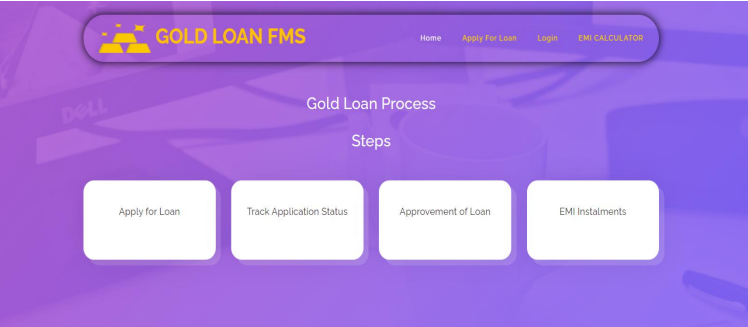
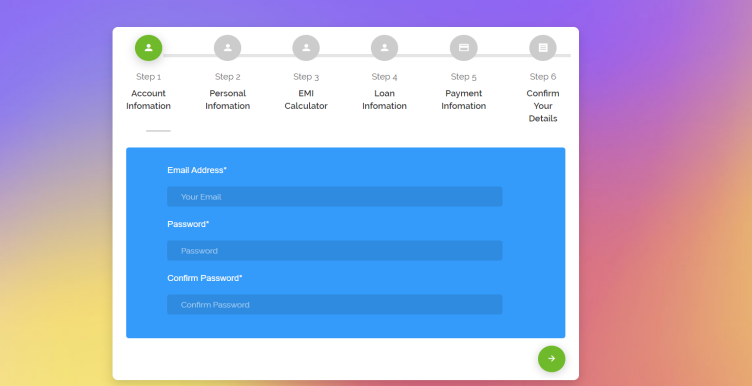
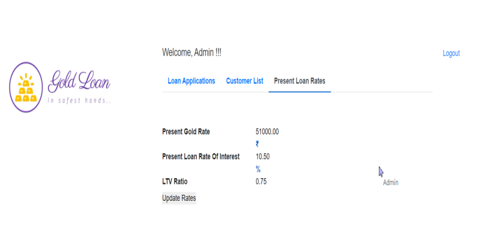

# Gold Loan Finance Management System (GLFMS)

## Table of Contents
- [Introduction](#introduction)
- [Features](#features)
- [Technologies Used](#technologies-used)
- [Setup](#setup)
- [Usage](#usage)
- [Modules](#modules)
- [Screenshots](#screenshots)
- [Future Enhancements](#future-enhancements)
- [Contributing](#contributing)
- [License](#license)

## Introduction
Gold Loan Finance Management System (GLFMS) is an online platform designed to help businesses and individuals manage loans given to customers who mortgage their gold. The system enables users to apply for loans, track loan statuses, make payments, and view details of gold assets.

This project was developed as a part of the B.Tech-CE program at Dharmsinh Desai University under the guidance of Prof. Brijesh S. Bhatt, Prof. Jigar M. Pandya, and Prof. Pinkal C. Chauhan.

## Features
- Apply for gold loans.
- View loan application status.
- EMI calculator to estimate loan payments.
- Online instalment payment for approved loans.
- Admin dashboard for approving/rejecting loans and managing gold rates.
- Customer details and payment tracking.

## Technologies Used
- **Backend:** Django (Python)
- **Frontend:** Bootstrap, HTML, JavaScript, jQuery
- **Database:** MySQL
- **Tools:** Visual Studio Code

## Setup
1. Clone this repository:
   ```bash
   git clone https://github.com/adityathakkar17/Gold-Loan-Finance-Management-System.git
   ```
2. Navigate to the project directory:
   ```bash
   cd GoldLoanFMS
   ```
3. Install dependencies:
   ```bash
   pip install -r requirements.txt
   ```
4. Set up the MySQL database and update `settings.py` with your database credentials.
5. Run the migrations:
   ```bash
   python manage.py migrate
   ```
6. Start the development server:
   ```bash
   python manage.py runserver
   ```

## Usage
- **Customers:** Can apply for loans, check loan status, and make payments.
- **Admin:** Can approve/reject loan applications, manage interest rates, and view customer details.

## Modules
1. **Loan Application Module:** Allows customers to apply for gold loans.
2. **EMI Payment Module:** Facilitates monthly or advance payment of EMIs.
3. **Admin Module:** Provides admin functionalities to manage loans, rates, and customers.
4. **Authentication Module:** Manages login and logout for customers and admins.

## Screenshots
### Home Page


### Loan Application


### Admin Dashboard


## Future Enhancements
- Support for multiple loans per customer.
- Integration with more payment gateways.
- Enhanced reporting and analytics for admins.

## Contributing
Contributions are welcome! Feel free to submit a pull request or open an issue.

## License
This project is licensed under the MIT License - see the [LICENSE](LICENSE) file for details.
